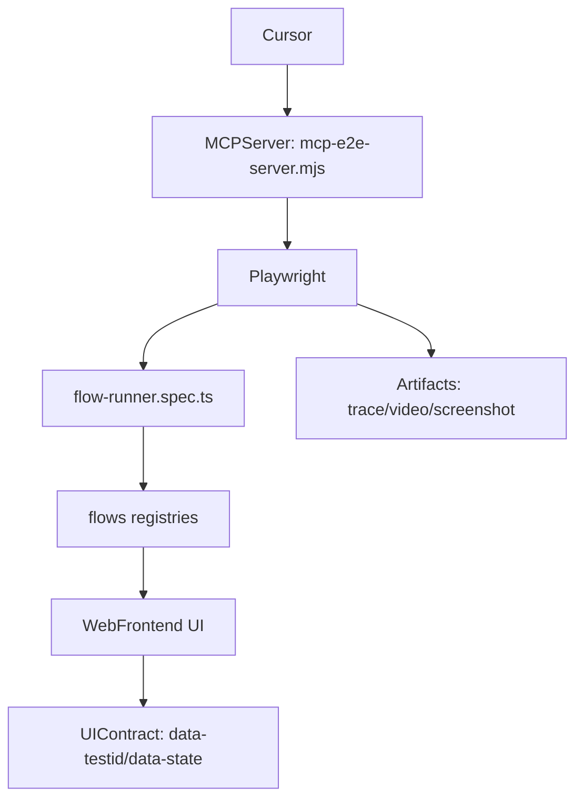

# MCP + E2E 总说明（唯一入口）

本文件是 **QUARCS web-frontend 的 MCP + Playwright E2E** 唯一入口说明，用于描述从 **Cursor / MCP Tool** 到 **Playwright 执行**、再到 **flow-runner 可组合步骤** 与 **UI testId/状态契约** 的完整流程。

> 约定：本文只描述“怎么跑、怎么扩展、怎么定位问题”。UI 的具体 `data-testid` 清单与索引仍以自动生成文件为准（见“资料与索引”）。

---

## 关键入口（你应该从哪里开始看）

- **MCP server（stdio）**：`apps/web-frontend/scripts/mcp-e2e-server.mjs`
  - 把现有 Playwright E2E 能力封装成 Cursor 可调用的 MCP tools
- **统一配置（单一入口）**：`apps/web-frontend/e2e.config.cjs`
  - 所有环境变量名、默认值、含义集中在这里（Playwright / MCP / flow）
- **Playwright 配置**：`apps/web-frontend/playwright.config.ts`
  - 主要消费 `E2E_BASE_URL`、录制策略、reduced motion、slowMo
- **可组合 flow-runner**：`apps/web-frontend/tests/e2e/flow-runner.spec.ts`
  - 通过环境变量输入步骤序列（JSON），组合执行 `flows/*` registry
- **flow 步骤实现**：`apps/web-frontend/tests/e2e/flows/*.ts`
  - `menuSteps.ts` / `deviceSteps.ts` / `scheduleSteps.ts` / `fileManagerSteps.ts` 等

---

## 架构概览（从 MCP 到 UI）



核心思想：
- **UI 可定位**：所有关键交互元素必须有稳定的 `data-testid`
- **状态优先**：重要操作前先读 `data-state` / `disabled` / `aria-disabled`
- **幂等步骤**：flow-runner 的 step 设计成“已达成则跳过”，避免重复操作导致不稳定

---

## 快速开始（本地 / CI 通用）

### 1) 前置条件

- 你需要自己启动前端站点（本仓库 Playwright 默认 **不自动启动 server**）：
  - 例如在 `apps/web-frontend` 下运行 `npm run dev`
- 让 E2E 指向正确的被测站点：
  - 设置 `E2E_BASE_URL`（见下方环境变量）

### 2) 直接跑 Playwright E2E

在 `apps/web-frontend` 目录：

```bash
npm run e2e
```

或指定某个 spec（例）：

```bash
npx playwright test tests/e2e/device-connect-capture.spec.ts --headed --workers=1
```

### 3) 跑 flow-runner（推荐：可组合步骤）

示例：只打开首页：

```bash
E2E_FLOW_CALLS_JSON='[{"id":"ui.goto","params":{"url":"/"}}]' \
npx playwright test tests/e2e/flow-runner.spec.ts --headed --workers=1
```

示例：设备连接 + 拍摄一次 + 保存（参数由 `deviceSteps` 消费）：

```bash
E2E_FLOW_CALLS_JSON='[
  {"id":"device.gotoHome"},
  {"id":"device.ensureDeviceSidebar"},
  {"id":"device.connectIfNeeded","params":{"deviceType":"MainCamera","driverText":"QHYCCD","connectionModeText":"SDK"}},
  {"id":"device.ensureCapturePanel"},
  {"id":"device.captureOnce","params":{"waitCaptureTimeoutMs":180000}},
  {"id":"device.save","params":{"doSave":true}}
]' \
npx playwright test tests/e2e/flow-runner.spec.ts --headed --workers=1
```

示例：**复杂任务计划表（Schedule）**——多行计划 + 保存/加载预设 + 启停态约束 + 清理：

```bash
E2E_FLOW_CALLS_JSON='[
  {"id":"device.gotoHome"},
  {"id":"device.ensureDeviceSidebar"},
  {"id":"device.connectIfNeeded","params":{"deviceType":"MainCamera","driverText":"QHYCCD","connectionModeText":"SDK"}},
  {"id":"device.ensureCapturePanel"},

  {"id":"schedule.openIfClosed"},
  {"id":"schedule.waitRunState","params":{"state":"idle","timeoutMs":60000}},
  {"id":"schedule.trimRows","params":{"keepRows":1}},

  {"id":"schedule.setupCapturePlan","params":{"row":1,"exposurePreset":"1 s","reps":3}},
  {"id":"schedule.setupCapturePlan","params":{"row":2,"exposurePreset":"10 ms","reps":5}},
  {"id":"schedule.setupCapturePlan","params":{"row":3,"exposurePreset":"10 s","reps":1}},
  {"id":"schedule.assertCellContainsText","params":{"row":1,"col":4,"text":"1 s"}},
  {"id":"schedule.assertCellContainsText","params":{"row":2,"col":4,"text":"10 ms"}},
  {"id":"schedule.assertCellContainsText","params":{"row":3,"col":4,"text":"10 s"}},

  {"id":"schedule.preset.saveAs","params":{"name":"e2e-complex-plan"}},
  {"id":"schedule.preset.selectByName","params":{"name":"e2e-complex-plan"}},
  {"id":"schedule.preset.okClose"},

  {"id":"schedule.startIfNotRunning"},
  {"id":"schedule.assertUiDisabledWhenRunning"},
  {"id":"schedule.pauseIfRunning"},

  {"id":"schedule.addRow"},
  {"id":"schedule.selectCell","params":{"row":4,"col":1}},
  {"id":"schedule.deleteSelectedRow"},

  {"id":"schedule.preset.selectByName","params":{"name":"e2e-complex-plan"}},
  {"id":"schedule.preset.deleteSelected"},
  {"id":"menu.confirmDialogConfirm"},
  {"id":"schedule.presetDialog.closeIfOpen"},

  {"id":"schedule.closeIfOpen"}
]' \
npx playwright test tests/e2e/flow-runner.spec.ts --headed --workers=1
```

示例：**运行任务计划表（只跑 1 行）**——执行前先清理历史多行，再 Start 并等待回到 idle：

```bash
E2E_FLOW_CALLS_JSON='[
  {"id":"device.gotoHome"},
  {"id":"device.ensureDeviceSidebar"},
  {"id":"device.connectIfNeeded","params":{"deviceType":"MainCamera","driverText":"QHYCCD","connectionModeText":"SDK"}},
  {"id":"device.ensureCapturePanel"},

  {"id":"schedule.openIfClosed"},
  {"id":"schedule.waitRunState","params":{"state":"idle","timeoutMs":60000}},
  {"id":"schedule.trimRows","params":{"keepRows":1}},

  {"id":"schedule.setupCapturePlan","params":{"row":1,"exposurePreset":"10 ms","reps":1}},
  {"id":"schedule.startIfNotRunning"},
  {"id":"schedule.waitRunState","params":{"state":"idle","timeoutMs":900000}},

  {"id":"schedule.closeIfOpen"}
]' \
npx playwright test tests/e2e/flow-runner.spec.ts --headed --workers=1
```

示例：**主相机 + 导星相机（QHYCCD/SDK）+ 赤道仪（EQMod Mount）→ 导星循环曝光 → 极轴校准（无论成功/失败都继续）→ 读取计划表并拍摄**

> 复用原则：把“连接设备”“开启导星循环”“极轴校准”“计划表加载/运行”拆成独立 step，避免一个大 step 里堆所有逻辑，便于在其它用例复用与调参（timeout/设备类型/驱动文本）。

```bash
E2E_FLOW_CALLS_JSON='[
  {"id":"device.gotoHome"},

  {"id":"device.connectIfNeeded","params":{"deviceType":"MainCamera","driverText":"QHYCCD","connectionModeText":"SDK"}},
  {"id":"device.connectIfNeeded","params":{"deviceType":"GuiderCamera","driverText":"QHYCCD","connectionModeText":"SDK"}},
  {"id":"device.connectIfNeeded","params":{"deviceType":"Mount","driverText":"EQMod Mount"}},

  {"id":"device.ensureCapturePanel"},
  {"id":"guider.loopExposureOn"},

  {"id":"pa.runOnce","params":{"timeoutMs":600000}},

  {"id":"schedule.openIfClosed"},
  {"id":"schedule.waitRunState","params":{"state":"idle","timeoutMs":60000}},
  {"id":"schedule.preset.selectByName","params":{"name":"my-schedule-plan"}},
  {"id":"schedule.preset.okClose"},

  {"id":"schedule.startIfNotRunning"},
  {"id":"schedule.waitRunState","params":{"state":"idle","timeoutMs":900000}},

  {"id":"guider.loopExposureOff"},
  {"id":"schedule.closeIfOpen"}
]' \
npx playwright test tests/e2e/flow-runner.spec.ts --headed --workers=1
```

> `E2E_FLOW_CALLS_JSON` 是新格式（推荐）。旧格式 `E2E_FLOW_JSON`/`E2E_FLOW` 仍兼容但不建议继续扩展。

### 4) 启动 MCP server（供 Cursor 调用）

在 `apps/web-frontend` 目录：

```bash
npm run mcp:e2e
```

MCP server 本质是 stdio 服务端，Cursor 会把它作为 MCP tools 的提供者。建议在 Cursor 的 MCP 配置里设置好：
- `E2E_BASE_URL`
- `E2E_HEADED`
- `E2E_RECORD`

---

## 环境变量（统一从 e2e.config.cjs 查）

所有环境变量的默认值与解释都在：`apps/web-frontend/e2e.config.cjs`。

最常用的几个：
- **`E2E_BASE_URL`**：被测站点 baseURL
- **`E2E_RECORD`**：是否录制 artifacts（trace/video/screenshot）
- **`E2E_HEADED`**：MCP 触发的 playwright 是否默认 headed
- **`E2E_UI_TIMEOUT_MS` / `E2E_STEP_TIMEOUT_MS` / `E2E_TEST_TIMEOUT_MS`**：交互/步骤/用例总超时
- **`E2E_FLOW_CALLS_JSON` / `E2E_FLOW_PARAMS_JSON`**：flow-runner 输入

---

## testId / 状态契约（如何让 E2E 稳定）

### 1) data-testid

- 目标：E2E 能稳定定位控件，不依赖文案/布局变化
- 验证脚本：`apps/web-frontend/scripts/validate-testids.js`

### 2) data-state / disabled / aria-*

- 目标：在执行动作前先判断状态，做幂等跳过或等待
- 常见模式：
  - root 容器：`data-state=open|closed`
  - 运行态：`data-run=running|idle|paused`
  - 按钮禁用：`disabled=true` 或 `aria-disabled=true`

### 3) e2e probes（降低“盲等”）

`apps/web-frontend/src/App.vue` 中有隐藏探针：
- `e2e-device-<DeviceType>-conn[data-state=connected|disconnected]`：设备真实连接状态
- `e2e-tilegpm[data-seq]`：每次出图渲染信号递增（用于等待“图像真的更新了”）

对应测试：`apps/web-frontend/tests/e2e/probes.spec.ts`

---

## flow-runner 组织方式（怎么扩展）

### registry 分层

flow-runner 合并多个 registry（见 `tests/e2e/flow-runner.spec.ts`）：
- `uiAtomicSteps`：通用 UI 原子动作（goto/click/type/wait/断言）
- `testIdAliasSteps`：为每个 `data-testid` 自动生成 `tid.<id>.<op>` 的步骤
- 业务宏步骤：`menuSteps` / `deviceSteps` / `scheduleSteps` / `fileManagerSteps` / `qhyccdSteps`

### 新增一个步骤（推荐流程）

1. 先给 UI 元素补齐 `data-testid`（必要时加 `data-state`）
2. 更新/校验 testId 索引（若流程要求）
3. 在对应 `flows/*Steps.ts` 增加幂等 step：先 Precheck 再 Steps 再 Postcheck
4. 用 `flow-runner.spec.ts` 组合验证

---

## 产物与调试（trace/video/screenshot）

- artifacts 由 Playwright `use.trace/use.video/use.screenshot` 决定（见 `playwright.config.ts`，由 `E2E_RECORD` 控制）
- MCP 提供 `web_screenshot` 等工具可直接产出截图到 `apps/web-frontend/test-results/`
- 如果遇到 Vuetify overlay/scrim 导致点击被遮挡：flow 内通常会先做 “dismissScrimIfAny” 兜底（见 `deviceSteps.ts` / `fileManagerSteps.ts`）

---

## 资料与索引（机器依赖：不要删除）

这些文件会被脚本/测试消费，即使内容看起来“像文档”，也不要删除：
- `apps/web-frontend/docs/e2e/e2e-contract.required.json`：E2E 必需契约（validate gate）
- `apps/web-frontend/docs/e2e/E2E_TEST_IDS_INDEX.json`：testId 索引（供 AI/flow/工具搜索）
- `apps/web-frontend/docs/e2e/E2E_TEST_IDS_DETAIL.csv`：详细清单（用于分析/统计）
- `apps/web-frontend/docs/e2e/E2E_TEST_IDS_MASTER_SUMMARY.*`：生成汇总（统计与可读性）
- `apps/web-frontend/docs/testid-validation-report.md`：validate-testids 输出报告（CI 门禁参考）

